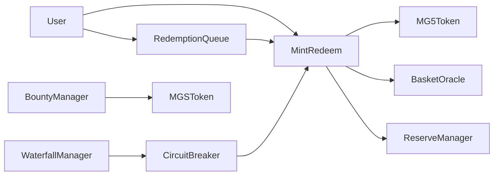

# M&G5 Global Reserve Protocol

M&G5 is an EVM-compatible AppChain protocol MVP for a basket-backed reserve token, `MG5`. The first deliverable is not a live appchain. It is a Solidity + Foundry monetary protocol that can be built, tested, and stress-tested locally before any Avalanche L1 / Subnet-EVM-style deployment work begins.

**Warning:** This is a local/devnet technical MVP with mocked reserves and mocked oracle data. It is not a production stablecoin, not an investment product, not a real reserve asset, and not ready for mainnet deployment.

## Basket

MG5 tracks the M&G5 basket using basis points:

| Sleeve | Weight | Purpose |
| --- | ---: | --- |
| GOLD | 20% | Hard-reserve monetary anchor |
| USD | 35% | Primary liquidity |
| CNY/CNH | 25% | Productive-economy anchor |
| EUR | 10% | Developed-market diversification |
| BRICK/EM | 10% | Emerging-market sleeve |

All v0 unit prices start normalized at `1e18`, so initial NAV is `1.00e18`.

## Architecture

Full MVP requirements are captured in [docs/SPECIFICATION.md](docs/SPECIFICATION.md).



## Contracts

- `MG5Token.sol`: ERC20 reserve token, mint/burn restricted to `MintRedeem`.
- `MGSToken.sol`: ERC20 simulation token for bounty rewards only.
- `BasketOracle.sol`: Mock prices and basket NAV.
- `ReserveManager.sol`: Mock reserves, haircuts, liabilities, and collateral ratio.
- `MintRedeem.sol`: Minting, immediate redemption, fees, and solvency checks.
- `RedemptionQueue.sol`: Escrows MG5 for redemptions that cannot safely process immediately.
- `WaterfallManager.sol`: Crisis defense order: DEX liquidity, fee buffer, war chest, reserve liquidation, queue, circuit breaker.
- `CircuitBreaker.sol`: Objective triggers for stale/frozen oracle, low collateral, queue overload, and manual pauses.
- `BountyManager.sol`: Simulated keeper rewards paid only in MGS.
- `ProtocolGovernor.sol`: v0 single-admin role registry.

## Local Setup

Install dependencies:

```bash
npm install
```

Install Foundry if needed:

```bash
curl -L https://foundry.paradigm.xyz | bash
foundryup
```

Build:

```bash
forge build
```

If Foundry is not installed, the repository also includes a local Solidity compile sanity check:

```bash
npm run compile:solc
```

## Tests

Run all tests:

```bash
forge test
```

Run focused stress/invariant suites:

```bash
forge test --match-contract StressRedemptionRun
forge test --match-contract StressOracleFreeze
forge test --match-contract StressReserveShock
forge test --match-contract Invariants
```

## Local Deployment

Start Anvil:

```bash
anvil
```

Deploy and configure the local MVP:

```bash
forge script script/DeployLocal.s.sol --rpc-url http://127.0.0.1:8545 --broadcast
```

The deployment script creates `ProtocolGovernor`, `MG5Token`, `MGSToken`, `BasketOracle`, `ReserveManager`, `WaterfallManager`, `CircuitBreaker`, `RedemptionQueue`, `BountyManager`, and `MintRedeem`, then seeds prices and reserves.

## Stress Scenarios

The test suite covers:

- 20% redemption run
- 40% redemption run
- oracle freeze
- stale oracle plus redemption run
- gold sleeve down 15%
- CNY sleeve down 10%
- EUR sleeve down 10%
- BRICK sleeve down 30%
- reserve haircut increase
- fee buffer and war chest depletion

Expected behavior:

- Under-collateralized MG5 cannot be minted.
- Unsafe immediate redemptions move to the queue path.
- Queued redemptions cannot process if solvency would break.
- Oracle stale/frozen state blocks NAV-dependent actions.
- Circuit breakers activate under objective failure states.
- MGS never contributes to MG5 collateral.

## Known Limitations

- Mocked oracle prices.
- Mocked reserve balances.
- No real fiat, gold, or tokenized reserve custody.
- No live DEX integration.
- No bridge.
- No appchain validators.
- No DAO governance.
- No yield mechanics.
- No mainnet deployment target.

## Future AppChain Roadmap

1. Local Foundry MVP
2. Private EVM devnet
3. Avalanche L1 / Subnet-EVM prototype
4. Validator set design
5. Bridge design
6. Oracle and reserve attestation integration
7. Legal/custody framework
8. Public testnet stress competition
9. Capped mainnet beta

The order is monetary logic first, stress tests second, appchain infrastructure third, and real reserves last.
