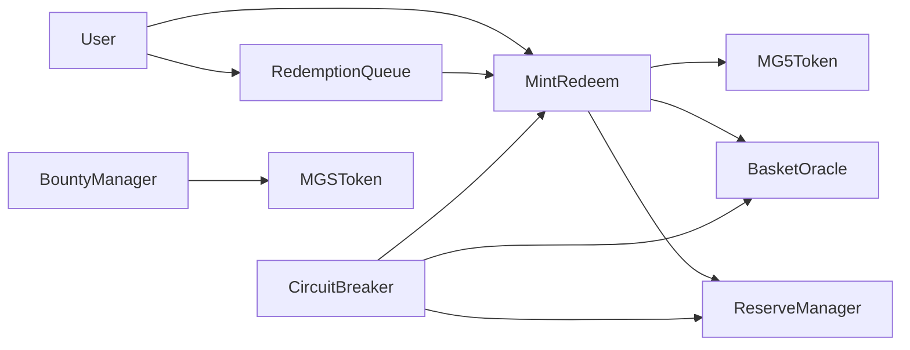

# M&G5 Protocol Architecture

M&G5 v0 is a local Solidity MVP for an EVM-compatible AppChain protocol. It proves monetary logic before any validator, bridge, custody, or appchain work.

## Components

- `MG5Token`: ERC20 reserve token. Minting and burning are restricted to `MintRedeem`.
- `MGSToken`: ERC20 share/governance simulation token. It is only used for bounty rewards and is never collateral.
- `BasketOracle`: Mock oracle for normalized basket sleeve prices and NAV.
- `ReserveManager`: Mock reserve accounting, haircuts, liabilities, and collateral ratio.
- `MintRedeem`: MG5 minting, immediate redemption, fees, and solvency enforcement.
- `RedemptionQueue`: Escrows MG5 when immediate redemption would be unsafe.
- `WaterfallManager`: Encodes the crisis response order.
- `CircuitBreaker`: Triggers/pause logic under objective failure conditions.
- `BountyManager`: MGS-only simulated keeper rewards.
- `ProtocolGovernor`: v0 role registry using OpenZeppelin `AccessControl`.

## Flow

## Solvency Model

Minting requires the post-mint collateral ratio to stay at or above `10500` bps. Immediate redemption requires the post-redemption collateral ratio to stay at or above `10200` bps. If immediate redemption cannot meet that rule, the user must use the redemption queue.

All reserve values are mocked and normalized in v0. The protocol uses haircut-adjusted reserves for collateral ratio checks.
